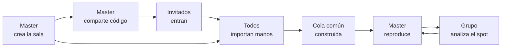

# Runout — Documento funcional y épicas

2026-09-18 · @Someone

## Resumen del producto

Runout es una sala web donde varios jugadores analizan la misma mano de póker a la vez, sincronizados en tiempo real. Un anfitrión reproduce el historial calle a calle y el resto ve exactamente el mismo estado en su pantalla.

El problema que resuelve es el de un grupo que ya se reúne cada semana y hoy comparte pantalla por Discord o Zoom. Ese formato convierte a una persona en operador y a las demás en espectadores: nadie más puede señalar, volver atrás ni aportar sus propias manos sin cortar la sesión. Además la imagen llega comprimida, y leer un stack en ciegas grandes sobre un vídeo reescalado cuesta más de lo que parece.

El usuario objetivo es un grupo de estudio de tres a ocho jugadores de cash online que ya usan un tracker (PokerTracker 4, Hold'em Manager 3 o Hand2Note) y exportan historiales de texto. No es una herramienta de entrenamiento individual ni un solver: no calcula estrategia, organiza la conversación que el grupo ya tiene.

La diferencia con compartir pantalla es que aquí el historial es dato, no píxeles: cada participante lo ve renderizado en su propia pantalla, con su baraja y sus unidades, y la cola de manos la construye el grupo entero en lugar de una sola persona.

## Tipos de usuario y roles

Hay dos roles y la diferencia entre ellos es una sola cosa: quién controla la reproducción. En todo lo demás — aportar manos, tomar notas, configurar su propia vista — Master e invitado son iguales.

| Capacidad | Master | Invitado |
| --- | --- | --- |
| Crear la sala y ponerle nombre | Sí | No |
| Compartir el código y el enlace | Sí | Sí |
| Importar manos a la cola | Sí | Sí, si el Master lo permite |
| Elegir qué mano se reproduce | Sí | No |
| Avanzar, retroceder, pausar y saltar de calle | Sí | No |
| Ver la mesa sincronizada en vivo | Sí | Sí |
| Escribir notas sobre la mano | Sí | Sí |
| Elegir su baraja, sus unidades y su tema | Sí | Sí |
| Ceder el rol de Master a otro participante | Sí | No |
| Expulsar a alguien y cerrar la sala | Sí | No |

El rol de Master nace con la sala: lo tiene quien la crea y no se pide, se cede. El Master puede pasarlo a cualquier participante en cualquier momento, y el traspaso es inmediato y visible para todos, sin interrumpir la mano en curso.

Si el Master pierde la conexión más de dos minutos, el rol pasa automáticamente al participante más antiguo de la sala para que la sesión no se quede bloqueada. Cuando el Master original vuelve, entra como invitado y puede pedir el rol de vuelta.

No hay rol de espectador ni de administrador global en esta versión. Tampoco hay cuentas de equipo: cada persona es una cuenta individual y las salas son efímeras.

## Flujo de usuario de punta a punta

El recorrido completo son seis etapas, de crear la sala a discutir un spot concreto. El punto de no retorno está en la cuarta: hasta que la cola tiene manos, la sala está vacía y no hay nada que analizar.

El bucle final entre reproducir y analizar es lo que ocupa la mayor parte de la sesión: se pausa, se discute, se retrocede y se vuelve a avanzar decenas de veces por mano.

1. **El Master crea la sala.** Le pone nombre a la sesión y fija un stake de referencia. La sala existe desde ese momento, aunque esté vacía.
2. **Comparte el acceso.** El sistema genera un código corto de ocho caracteres y un enlace copiable. El Master lo pega en el chat del grupo.
3. **Los invitados entran.** Con el enlace entran directamente; con el código lo teclean y confirman su alias. No hace falta que se registren antes de ver la sala.
4. **Todos aportan manos.** Cada uno sube el archivo exportado de su tracker o pega el texto del historial. Cada mano queda firmada con su autor.
5. **El Master reproduce.** Elige una mano de la cola y controla la línea de tiempo: acción a acción, saltando de calle o dejándola correr.
6. **El grupo analiza.** Todos ven el mismo estado al mismo tiempo, se pausa en el punto de decisión, se discute por voz y la conclusión queda como nota en la mano.

La voz sigue yendo por Discord o por donde el grupo ya hable. Runout no lleva audio en esta versión, y es deliberado: el grupo ya tiene resuelta esa parte.

## Mapa de épicas

Siete épicas cubren el producto. Cinco son imprescindibles para que una sesión funcione de principio a fin; las otras dos pueden entrar a medias y crecer después.

| Épica | Objetivo | Prioridad |
| --- | --- | --- |
| E1 · Salas | Crear una sala, compartirla y entrar con código o enlace | MVP |
| E2 · Importación de manos | Convertir historiales de tracker en manos reproducibles y firmadas | MVP |
| E3 · Cola compartida | Una sola lista de manos con sus metadatos, construida entre todos | MVP |
| E4 · Reproductor | Recorrer la mano calle a calle sobre una mesa legible | MVP |
| E5 · Sincronización | Que todos vean el mismo estado en el mismo instante | MVP |
| E6 · Biblioteca y notas | Conservar, buscar y anotar manos entre sesiones | Parcial en MVP |
| E7 · Preferencias y perfil | Leer la mesa a su gusto e identificarse en los historiales | Parcial en MVP |

El orden de construcción no es el de la tabla. E2 va primero porque sin manos parseadas no hay nada que enseñar, y E4 se puede construir en local mucho antes de que exista E5.

## E1 · Salas

Una sala es el contenedor de una sesión de estudio: tiene un anfitrión, unos participantes, una cola de manos y un estado de reproducción. Es efímera por defecto y se archiva sola a los treinta días sin actividad.

**H1.1 — Crear una sala.** Como jugador que organiza la sesión, quiero crear una sala con nombre y stake de referencia, para tener un sitio al que convocar al grupo.

- Al crearla quedo como Master de forma automática.
- El nombre admite hasta 60 caracteres y el stake es opcional.
- La sala existe y es accesible aunque no tenga ninguna mano todavía.

**H1.2 — Obtener código y enlace.** Como Master, quiero un código corto y un enlace copiable, para pegarlos en el chat del grupo sin explicar nada más.

- El código tiene ocho caracteres alfanuméricos y excluye los que se confunden al leerlos en voz alta.
- Un botón copia el enlace completo al portapapeles y confirma que lo ha hecho.
- El código sigue siendo válido mientras la sala esté abierta.

**H1.3 — Entrar con código.** Como invitado, quiero teclear el código y entrar, para no depender de que me reenvíen el enlace.

- El campo acepta el código con o sin guion y sin distinguir mayúsculas.
- Un código inexistente muestra un error junto al campo, sin recargar la página.
- Al entrar veo el estado actual de la sala, incluida la mano que se esté reproduciendo.

**H1.4 — Entrar por enlace directo.** Como invitado, quiero abrir el enlace y estar dentro, para no dar ningún paso intermedio.

- El enlace lleva a la sala y pide solo confirmar el alias visible.
- Si ya he entrado antes en esa sala, entro directamente con el alias anterior.

**H1.5 — Ver quién está en la sala.** Como participante, quiero ver la lista de presentes y quién es el Master, para saber si falta alguien antes de empezar.

- La lista muestra alias, rol y cuántas manos ha aportado cada uno.
- Las entradas y salidas se reflejan en menos de dos segundos.

**H1.6 — Ceder el rol de Master.** Como Master, quiero pasarle el control a otro participante, para que conduzca él la siguiente mano.

- El traspaso es inmediato y se anuncia a toda la sala.
- La mano en curso no se reinicia ni pierde su posición.
- Quien cede pasa a ser invitado y sus controles se bloquean al instante.

## E2 · Importación de manos

Esta épica convierte texto de tracker en manos que el reproductor entiende. Es la que más riesgo esconde: los formatos varían entre salas y versiones, y una mano mal parseada rompe la confianza en toda la herramienta.

**H2.1 — Subir archivos.** Como participante, quiero arrastrar los archivos exportados de mi tracker, para no copiar y pegar mano por mano.

- Acepto .txt y .zip, hasta 20 MB por archivo y varios archivos a la vez.
- Cada archivo muestra su estado: formato detectado, manos leídas y manos descartadas.
- Puedo quitar un archivo de la lista antes de confirmar la importación.

**H2.2 — Pegar texto plano.** Como participante, quiero pegar el historial de una mano suelta, para compartir algo que acabo de jugar sin exportar nada.

- El análisis ocurre al pegar, sin pulsar ningún botón.
- Si el texto contiene varias manos, se importan todas.

**H2.3 — Detectar el formato.** Como participante, quiero que el sistema reconozca solo de qué tracker viene el archivo, para no tener que saberlo yo.

- Se reconocen PokerTracker 4, Hold'em Manager 3, Hand2Note y el texto de sala en crudo.
- El formato detectado se muestra junto al nombre del archivo.
- Si no se reconoce, se dice cuál se ha intentado y se ofrece elegirlo a mano.

**H2.4 — Ver qué no se ha podido leer.** Como participante, quiero ver qué manos se han descartado y por qué, para saber si me falta algo importante.

- El resumen dice cuántas manos entran y cuántas se omiten.
- Puedo abrir el detalle y ver el texto original de cada mano descartada.
- Una mano descartada nunca bloquea la importación del resto.

**H2.5 — Asignar el autor.** Como participante, quiero que las manos que subo queden firmadas con mi nombre, para que el grupo sepa de quién es cada spot.

- El autor se asigna por defecto a quien importa.
- El Master puede reasignar el autor de una mano concreta después de importarla.
- El autor viaja con la mano a la biblioteca.

**H2.6 — Identificar al héroe.** Como participante, quiero que se detecte cuál de los asientos soy yo, para verme abajo en la mesa como en mi tracker.

- La detección usa los alias guardados en mi perfil.
- Si ninguno coincide, se me pide elegir el asiento una sola vez por archivo.
- El héroe se dibuja siempre en la posición inferior central, sea cual sea su posición en la mesa.

## E3 · Cola de manos compartida

La cola es la lista de manos de la sesión, común a todos y ordenable. Es lo que convierte la sala en una sesión de estudio y no en una sucesión de manos sueltas.

**H3.1 — Ver la cola.** Como participante, quiero ver todas las manos de la sesión en un panel lateral, para saber qué queda por repasar.

- Cada fila muestra autor, fecha, posiciones enfrentadas, stake, bote final y calle en la que murió la acción.
- La mano en reproducción aparece destacada sin ambigüedad.
- El panel se puede colapsar para dejar la mesa a pantalla completa.

**H3.2 — Ver la cola crecer en vivo.** Como participante, quiero ver aparecer las manos que suben los demás, para no preguntar si ya han subido las suyas.

- Una mano importada por cualquiera aparece en la cola de todos en menos de dos segundos.
- La llegada no mueve el foco ni interrumpe la reproducción en curso.

**H3.3 — Buscar y filtrar.** Como Master, quiero filtrar la cola por autor, posición o calle final, para encontrar rápido el tipo de spot que quiero tratar.

- Los filtros se combinan y se limpian de una vez.
- El resultado dice cuántas manos quedan tras filtrar.
- El filtro es personal: no cambia lo que ven los demás.

**H3.4 — Elegir la mano que se reproduce.** Como Master, quiero seleccionar una mano de la cola, para llevar a toda la sala a ese spot.

- Al seleccionarla, la mesa de todos carga esa mano por el principio.
- El invitado ve las filas como información, no como algo pulsable.

**H3.5 — Reordenar la cola.** Como Master, quiero mover manos arriba y abajo, para preparar el orden de la sesión antes de empezar.

- El orden es el mismo para todos y se conserva al recargar.
- Reordenar no cambia la mano que se está reproduciendo.

**H3.6 — Quitar una mano de la sesión.** Como Master, quiero sacar una mano de la cola, para descartar duplicados o manos irrelevantes.

- Quitarla de la sala no la borra de la biblioteca de su autor.
- La acción se puede deshacer durante los diez segundos siguientes.

## E4 · Reproductor de manos

El reproductor es la mesa y sus controles. Su trabajo no es parecerse a una sala de póker, sino dejar leer de un vistazo el tamaño del bote, los stacks en ciegas grandes y a quién le toca actuar.

**H4.1 — Ver la mesa.** Como participante, quiero ver la mano en una mesa cenital, para reconocer la situación sin leer texto.

- Se dibujan los asientos ocupados con alias, posición y stack en ciegas grandes y en fichas.
- Las cartas comunitarias aparecen según avanza la calle; las que faltan se ven como huecos.
- Las cartas del héroe se muestran siempre; las de los rivales solo si llegan al showdown.
- Los jugadores retirados se atenúan en lugar de desaparecer.

**H4.2 — Avanzar y retroceder acción a acción.** Como Master, quiero moverme una acción adelante o atrás, para pararme justo en el punto de decisión.

- Cada paso actualiza bote, stacks y apuestas en la mesa.
- El contador dice en qué acción estamos y cuántas tiene la mano.
- En la primera acción el botón de retroceder queda deshabilitado, no oculto.

**H4.3 — Saltar de calle.** Como Master, quiero ir directo al flop, al turn, al river o al showdown, para no pasar acción por acción cuando ya sabemos lo que pasó.

- La barra de progreso divide la mano en cinco calles de anchura igual.
- Pulsar una calle lleva a su primera acción.
- Las calles que la mano no alcanzó se marcan como no disponibles.

**H4.4 — Reproducir en automático.** Como Master, quiero darle a play y que la mano avance sola, para enseñar el desarrollo sin ir pulsando.

- La velocidad se elige entre 0,5×, 1×, 1,5× y 2×.
- Al llegar al final se detiene en el showdown, no vuelve a empezar.
- Pausar deja la mano exactamente donde estaba.

**H4.5 — Leer las apuestas y los botes.** Como participante, quiero ver cuánto se apuesta y qué parte del bote representa, para juzgar el sizing sin calcular.

- Cada apuesta muestra su importe en ciegas grandes y su porcentaje del bote.
- El bote central distingue el acumulado de lo que hay en juego en la calle.
- Los botes secundarios se muestran por separado, con quién compite en cada uno.

**H4.6 — Ver el showdown.** Como participante, quiero ver las manos que se enseñaron y quién ganó cada bote, para cerrar la mano sin dudas.

- Las cartas mostradas se voltean y se etiqueta la jugada de cada uno.
- La mano ganadora se marca y se indica cuánto se lleva de cada bote.

**H4.7 — Manejar el reproductor con el teclado.** Como Master, quiero usar atajos, para conducir la sesión sin soltar la mano del teclado.

- Espacio reproduce y pausa; las flechas mueven acción a acción; mayúsculas y flecha saltan de calle.
- Los atajos no responden cuando el foco está en un campo de texto.
- Los atajos están inactivos para los invitados.

## E5 · Sincronización en tiempo real

Esta épica es la promesa del producto: lo que el Master hace, los demás lo ven al instante. También es la que decide la confianza, porque un invitado que no sabe si va al día deja de mirar la pantalla y pregunta en voz alta.

**H5.1 — Recibir el estado en vivo.** Como invitado, quiero que mi mesa refleje lo que hace el Master, para seguir la explicación sin ir por detrás.

- Un cambio del Master llega a los invitados en menos de 300 ms en condiciones normales.
- Se propagan la mano seleccionada, la acción actual, la calle y el estado de pausa.
- Nada de lo que yo haga en mi pantalla altera lo que ven los demás.

**H5.2 — Ver los controles bloqueados.** Como invitado, quiero ver los controles del reproductor aunque no pueda usarlos, para entender qué está haciendo el Master.

- Los botones mantienen tamaño y posición, y cambian relleno, borde y color de icono.
- Cada botón bloqueado explica por qué lo está al recibir el foco o el puntero.
- Nunca se ocultan.

**H5.3 — Saber si voy al día.** Como invitado, quiero un indicador claro de sincronía, para saber si lo que veo es lo que ve el resto.

- Hay tres estados: sincronizado, recuperando y sin conexión.
- En recuperando, la mesa se atenúa para que no me fíe de lo que muestra.
- El indicador muestra la latencia actual en milisegundos.

**H5.4 — Recuperarme de una caída.** Como invitado, quiero volver al estado correcto al recuperar la conexión, para no tener que recargar ni preguntar.

- Al reconectar se pide el estado completo de la sala, no los cambios perdidos.
- La vuelta es directa al estado actual, sin reproducir lo ocurrido mientras tanto.
- Si la reconexión falla tres veces, se ofrece recargar con un botón.

**H5.5 — Entrar a mitad de sesión.** Como invitado que llega tarde, quiero caer en el punto exacto donde está el grupo, para incorporarme sin que nadie me ponga al día.

- Al entrar recibo la mano en curso y su acción actual.
- Si no hay ninguna mano en reproducción, veo la cola y un estado de espera.

**H5.6 — Ver quién sigue conectado.** Como Master, quiero ver el estado de conexión de cada participante, para esperar a alguien antes de seguir.

- Cada participante muestra un indicador de conectado, inestable o ausente.
- Una desconexión de más de treinta segundos se marca visiblemente en la lista.

## E6 · Biblioteca y notas

Lo que hace que la herramienta sobreviva a la sesión. Las notas entran en el MVP porque sin ellas la conclusión del grupo se pierde; la biblioteca completa puede esperar a que haya manos acumuladas que merezcan buscarse.

**H6.1 — Anotar una mano.** Como participante, quiero escribir la conclusión del grupo sobre la mano, para no repetir la discusión dentro de tres semanas.

- La nota queda asociada a la mano, con autor y fecha.
- Varias personas pueden anotar la misma mano.
- Las notas se ven en la sala y viajan con la mano a la biblioteca.

**H6.2 — Marcar una mano.** Como participante, quiero marcar una mano, para volver a ella sin buscarla.

- La marca es personal y no la ven los demás.
- Las marcadas se filtran en un clic desde la biblioteca.

**H6.3 — Ver mis manos guardadas.** Como participante, quiero una biblioteca con todo lo que he aportado y todo lo que se ha compartido conmigo, para preparar la próxima sesión.

- La lista muestra mano, autor, stake, bote final, calle final, fecha y etiquetas.
- Se ordena por cualquiera de esas columnas y por defecto por bote final descendente.
- Hay vista de lista y vista de tarjetas.

**H6.4 — Filtrar la biblioteca.** Como participante, quiero filtrar por autor, stake, posición, calle final o bote mínimo, para encontrar un tipo de spot concreto.

- Los filtros se combinan y se limpian de una vez.
- La cabecera dice cuántas manos cumplen el filtro del total.

**H6.5 — Etiquetar manos.** Como participante, quiero poner etiquetas a las manos, para agrupar por tema en lugar de por fecha.

- Puedo crear etiquetas nuevas desde la propia mano.
- Una mano admite varias etiquetas.
- Las etiquetas son del grupo, no personales.

**H6.6 — Llevar manos de la biblioteca a una sala.** Como Master, quiero seleccionar varias manos guardadas y añadirlas a la sesión, para preparar el temario antes de que llegue nadie.

- Puedo seleccionar varias a la vez y añadirlas en una sola acción.
- Las manos conservan su autor original, no pasan a ser mías.

## E7 · Preferencias y perfil

Casi todo aquí es lectura personal: cómo quiere cada uno ver la mesa. La excepción son los alias de sala, que no son cosméticos — sin ellos la importación no sabe quién es el héroe y la mesa se dibuja mal.

**H7.1 — Declarar mis alias de sala.** Como participante, quiero guardar los nombres con los que juego, para que se me reconozca automáticamente en cada historial.

- Admite varios alias separados por comas.
- Se usan al importar para detectar el asiento del héroe.
- Cambiarlos no reprocesa las manos ya importadas.

**H7.2 — Elegir el estilo de baraja.** Como participante, quiero elegir entre la baraja clásica y la de palo lleno, para leer las cartas como me resulta natural.

- La elección es personal y no cambia lo que ven los demás en la sala.
- El cambio se aplica al instante, sin recargar.
- Se recuerda entre sesiones y dispositivos.

**H7.3 — Elegir la unidad de stacks y botes.** Como participante, quiero ver las cifras en ciegas grandes, en fichas o en ambas, para pensar en la unidad en la que razono.

- La unidad elegida manda en la mesa, en la cola y en la biblioteca a la vez.
- Con ambas activas, la principal es la ciega grande y la secundaria va atenuada.

**H7.4 — Ajustar la lectura de la mesa.** Como participante, quiero decidir si veo el porcentaje del bote y si uso baraja de cuatro colores, para quitar de la pantalla lo que no miro.

- Cada opción se aplica al momento y se previsualiza en el propio ajuste.
- La baraja de palo lleno lleva los cuatro colores siempre.

**H7.5 — Fijar la velocidad por defecto.** Como Master, quiero que la reproducción automática arranque siempre a mi velocidad, para no ajustarla en cada mano.

- Solo se aplica cuando soy yo quien controla la sala.
- Puedo cambiarla en la propia mano sin alterar el valor por defecto.

**H7.6 — Ocultar los nicks de los rivales.** Como participante, quiero sustituir los nombres de los rivales por su posición, para compartir una mano sin exponer a nadie.

- Es un ajuste del autor de la mano y viaja con ella a la sala.
- Los alias del propio grupo no se ocultan.

## Alcance del MVP y fuera de alcance

El MVP es una sesión completa del martes por la noche, de principio a fin, sin nada más. La prueba de que está listo es poder cancelar la llamada de pantalla compartida y no echarla de menos.

Entra en la primera versión: crear sala y entrar por código o enlace, importar de los tres trackers principales, cola compartida con sus metadatos, reproductor completo calle a calle, sincronización con indicador de estado, notas por mano y los ajustes de lectura de la mesa.

Queda fuera a propósito, con su motivo:

| Fuera del MVP | Por qué |
| --- | --- |
| Audio y vídeo en la sala | El grupo ya tiene Discord y resolverlo bien es un producto entero |
| Dibujar o señalar sobre la mesa | Aporta menos que la voz y multiplica el estado a sincronizar |
| Cálculo de equity o rangos | Convierte la herramienta en un solver, que no es lo que falta |
| Chat de texto en la sala | La conversación va por voz; las notas cubren lo que hay que conservar |
| Importación automática desde el tracker | Exige instalar algo en el escritorio de cada uno |
| Torneos y mesas de más de nueve asientos | El grupo juega cash 6-max; ampliarlo sin necesidad complica la mesa |
| Estadísticas agregadas del grupo | No hay datos suficientes hasta que se acumulen sesiones |
| Cuentas de equipo y facturación | No hay modelo de negocio que validar todavía |

Los dos supuestos sobre los que se apoya todo esto conviene comprobarlos pronto: que los historiales de los tres trackers se parsean con fiabilidad suficiente, y que la latencia de sincronización se mantiene por debajo de lo que el ojo nota mientras alguien habla.

## Criterios transversales y glosario

Estos criterios se aplican a toda historia del documento y no se repiten en cada una. Una historia no está terminada si los incumple.

- Toda cifra de dinero se muestra en la unidad que el usuario haya elegido, nunca en una mezcla sin etiquetar.
- Ningún control se oculta por falta de permiso: se muestra bloqueado y explica por qué.
- Toda acción destructiva se puede deshacer, o pide confirmación si no se puede.
- El texto mantiene contraste 4,5:1 sobre su fondo, y los objetivos táctiles miden 44 px como mínimo.
- Todo control es alcanzable y operable con teclado, y los botones de solo icono llevan etiqueta accesible.
- Un error de red nunca deja la pantalla en blanco: se dice qué ha fallado y qué se puede hacer.
- La interfaz está en español, con los términos de póker que el grupo usa en voz alta.

Sobre las historias: cada una es independiente y se puede construir sin esperar a las demás de su épica, está escrita como conversación y no como especificación cerrada, entrega valor visible por sí sola, es lo bastante pequeña para caber en una iteración y sus criterios de aceptación son comprobables sin ambigüedad. Las que no cumplan alguna de esas condiciones al planificar conviene partirlas antes de estimarlas.

| Término | Qué significa aquí |
| --- | --- |
| Mano | Una partida completa, del reparto al showdown o al último fold |
| Calle | Cada fase de apuestas: preflop, flop, turn, river y showdown |
| Board o runout | Las cartas comunitarias tal como han ido saliendo |
| Ciega grande (BB) | Unidad de medida de stacks y botes, independiente del stake |
| Stack | Fichas que tiene un jugador delante al empezar la mano |
| Bote principal | El bote que disputan todos los jugadores activos |
| Bote lateral | El bote extra que disputan solo quienes tenían fichas de sobra tras un all-in |
| SPR | Relación entre stack efectivo y bote, usada para juzgar el compromiso |
| Héroe | El jugador desde cuyo punto de vista se grabó la mano |
| Posiciones | UTG, HJ, CO, BTN, SB y BB en una mesa de seis |
| Historial | El texto que exporta el tracker con todo lo ocurrido en la mano |
| Tracker | Programa que registra las manos jugadas: PokerTracker 4, Hold'em Manager 3, Hand2Note |
