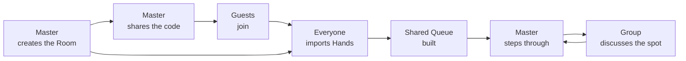

# Runout — Functional spec and epics

2026-09-19 · @Someone

Domain terms (Room, Master, Guest, Hand, Hero, Author, Queue, Playback, Action, Street…) are defined in [CONTEXT.md](CONTEXT.md) and used here with exactly that meaning. Decisions that shape the model are in [docs/adr/](docs/adr/).

## Product summary

Runout is a web Room where several players review the same poker Hand at once, synchronised in real time. The Master steps through the Hand Action by Action and everyone else sees exactly the same table on their own screen.

It solves the problem of a group that already meets every week and today shares a screen over Discord or Zoom. That format turns one person into the operator and everyone else into spectators: nobody else can point, go back or bring their own Hands without breaking the session. The picture also arrives compressed, and reading a stack in big blinds off a rescaled video is harder than it looks.

The target user is a study group of three to eight online cash players who already use a Tracker (PokerTracker 4, Hold'em Manager 3 or Hand2Note) and export text Hand Histories. It is not a solo training tool nor a solver: it computes no strategy, it organises the conversation the group already has.

The difference from screen sharing is that the Hand History is data, not pixels: each Participant sees it rendered on their own screen, with their own deck and Display Unit, and the Queue is built by the whole group instead of one person.

The study group itself lives outside Runout. There are no groups or teams inside the app: only Rooms, shared with the group through whatever chat it already uses.

## Participants, roles and identity

There are two roles, and the difference between them is a single thing: who controls Playback. In everything else — bringing Hands, writing Notes, configuring their own view — Master and Guest are equal.

| Capability | Master | Guest |
| --- | --- | --- |
| Create the Room and name it | Yes (as its creator) | — |
| Share the Room Code and link | Yes | Yes |
| Import Hands into the Queue | Yes | Yes |
| Choose which Hand is loaded | Yes | No |
| Step Actions and jump Streets | Yes | No |
| Toggle Hide Opponent Names | Yes | No |
| See the synchronised table live | Yes | Yes |
| Write Notes on a Hand | Yes | Yes |
| Edit or delete Notes | Yes | No |
| Reorder and remove Queue Entries | Yes | No |
| Reassign a Hand's Author | Yes | No |
| Choose their own deck, Display Unit and language | Yes | Yes |
| Hand the Master role to another Participant | Yes | No |
| Kick a Participant and close the Room | Yes | No |

The Master role is born with the Room: whoever creates it holds it. It is never requested, only handed over. The Master can hand it to any Participant at any time; the handover is immediate, visible to everyone, and does not touch Playback. A Master cannot simply leave: leaving means handing the role over or closing the Room.

If the Master loses connection for more than two minutes, the role passes automatically to the Participant who has been present the longest, so the session never gets stuck. When the former Master comes back they join as a Guest; if they want the role back they ask for it out loud.

Nobody needs an account. Every Participant has an identity bound to their browser from the first visit, which owns their Hands, Marks, Screen Names and preferences. An optional account only carries that identity to other devices (ADR 0003).

## End-to-end flow

The full journey has six stages, from creating the Room to discussing a specific spot. The point of no return is the fourth: until the Queue has Hands, the Room is empty and there is nothing to review.

The loop between stepping and discussing is where most of the session goes: stop, discuss, go back, step forward again, dozens of times per Hand. Playback only moves when the Master moves it; there is no automatic play, because the conversation sets the pace.

1. **The Master creates the Room.** They give the session a name. The Room exists from that moment, even while empty.
2. **They share access.** The system generates an eight-character Room Code and a copyable link. The Master pastes it into the group's chat.
3. **Guests join.** With the link they go straight in; with the code they type it. Either way they only confirm their Display Name. No registration.
4. **Everyone brings Hands.** Each person uploads their Tracker export or pastes Hand History text. Each Hand gets its Author.
5. **The Master drives Playback.** They load a Hand from the Queue and step through it Action by Action or jump between Streets.
6. **The group discusses.** Everyone sees the same state at the same moment; they stop at the decision point, talk over voice, and the conclusion is left as a Note on the Hand.

Voice still goes through Discord or wherever the group already talks. Runout carries no audio in this version, on purpose: the group has that solved.

## Epic map

Seven epics cover the product. Five are essential for a session to work end to end; the other two can land partially and grow later.

| Epic | Goal | Priority |
| --- | --- | --- |
| E1 · Rooms | Create a Room, share it, join it with a code or a link, and run its lifecycle | MVP |
| E2 · Hand import | Turn Hand Histories into playable Hands with their Hero and Author | MVP |
| E3 · Shared Queue | One list of Hands with their metadata, built by everyone | MVP |
| E4 · Player | Step through a Hand on a readable table | MVP |
| E5 · Synchronisation | Everyone sees the same Playback at the same instant | MVP |
| E6 · Library and Notes | Keep, find and annotate Hands across Rooms | Partial in MVP |
| E7 · Preferences and profile | Read the table your own way and be recognised in Hand Histories | Partial in MVP |

Build order is not the table order. E2 goes first because without parsed Hands there is nothing to show, and E4 can be built locally long before E5 exists.

## E1 · Rooms

A Room holds exactly one study session: its Participants, a Queue and the Playback. It closes when its Master closes it, or on its own after 30 minutes with nobody connected. A closed Room never reopens.

**H1.1 — Create a Room.** As the player organising the session, I want to create a Room with a name, so I have somewhere to call the group to.

- On creation I become the Master automatically.
- The name allows up to 60 characters.
- The Room exists and is reachable even with no Hands yet.

**H1.2 — Get the Room Code and link.** As Master, I want a short code and a copyable link, so I can paste them into the group chat without explaining anything else.

- The Room Code has eight alphanumeric characters and excludes those easily confused when read aloud.
- A button copies the full link to the clipboard and confirms it did.
- The code stays valid while the Room is open, and stops working once it closes.

**H1.3 — Join with the Room Code.** As a Guest, I want to type the code and get in, so I don't depend on someone forwarding me the link.

- The field accepts the code with or without a dash and ignores case.
- An unknown or closed code shows an error next to the field, without reloading the page.
- On joining I see the Room's current state, including the loaded Hand and its current Action.

**H1.4 — Join by direct link.** As a Guest, I want to open the link and be in, with no intermediate step.

- The link leads to the Room and only asks me to confirm my Display Name.
- The Display Name is prefilled with the one I used last, in any Room.

**H1.5 — See who is in the Room.** As a Participant, I want to see who is present and who is Master, so I know whether someone is missing before we start.

- The list shows Display Name, role and how many Hands in the Queue each person is Author of.
- Joins and leaves show up in under two seconds.

**H1.6 — Hand over the Master role.** As Master, I want to pass control to another Participant, so they drive the next Hand.

- The handover is immediate and announced to the whole Room.
- Playback is not reset and keeps its current Action.
- The former Master becomes a Guest and their controls lock instantly.

**H1.7 — Leave or lose the Master.** As a Participant, I want the Room to keep working when the Master leaves or drops, so the session never gets stuck.

- A Master who tries to leave must choose between handing the role over and closing the Room.
- If the Master is disconnected for more than two minutes, the role passes to the Participant present the longest, and the Room is told.
- A former Master who comes back joins as a Guest.

**H1.8 — Kick a Participant.** As Master, I want to remove someone from the Room.

- The kicked Participant leaves immediately and cannot rejoin this Room.
- Their Queue Entries stay in the Queue.
- Kicking asks for confirmation.

**H1.9 — Close the Room.** As Master, I want to end the session for everyone.

- Closing asks for confirmation, since a closed Room cannot be reopened.
- Every Participant sees that the Room has closed, not a blank or broken screen.
- The Hands that were in the Queue remain in the Libraries of everyone who was in the Room.

## E2 · Hand import

This epic turns Tracker text into Hands the player understands. It hides the most risk: formats vary across Poker Sites and versions, and one badly parsed Hand breaks trust in the whole tool.

**H2.1 — Upload files.** As a Participant, I want to drag in my Tracker exports, so I don't copy and paste Hand by Hand.

- Accepts .txt and .zip, up to 20 MB per file and several files at once.
- Each file shows its status: detected format, Hands read and Hands discarded.
- I can remove a file from the list before confirming the import.

**H2.2 — Paste plain text.** As a Participant, I want to paste the Hand History of a single Hand, so I can share something I just played without exporting anything.

- Parsing happens on paste, with no button to press.
- If the text holds several Hands, all of them are imported.

**H2.3 — Detect the format.** As a Participant, I want the system to recognise which Tracker and Poker Site the file comes from, so I don't have to know.

- Recognises PokerTracker 4, Hold'em Manager 3, Hand2Note and raw Poker Site text.
- The detected format is shown next to the file name.
- If it is not recognised, it says which formats were tried and offers to pick one by hand.

**H2.4 — See what could not be read.** As a Participant, I want to see which Hands were discarded and why, so I know whether I am missing something important.

- The summary says how many Hands come in and how many are skipped.
- I can open the detail and see the original text of each discarded Hand, with its reason (unrecognised format, more than nine seats, duplicate…).
- A discarded Hand never blocks the import of the rest.

**H2.5 — Handle duplicates.** As a Participant, I want importing the same Hand twice not to clutter the Queue.

- A Hand with the same Poker Site, hand ID and Hero as an existing Hand is a duplicate: it is skipped and reported (ADR 0002).
- The same hand ID from a different Hero is a separate Hand, with its own hole cards. The Queue shows that the two are the same real-world hand, but never merges them.

**H2.6 — Assign the Hero and the Author.** As a Participant, I want each Hand attributed to whoever played it, so the group knows whose spot it is.

- The Hero is taken from the Hand History itself.
- The Author is the Participant of the Room whose Screen Names include the Hero's name.
- If nobody matches, the Importer becomes the Author and is offered to add that Screen Name to their own.
- The Master can reassign the Author of any Hand after import.
- The Author travels with the Hand to the Library. The Importer is kept for audit only.

## E3 · Shared Queue

The Queue is the Room's ordered list of Hands, shared by everyone. It is what turns the Room into a study session rather than a string of loose Hands.

**H3.1 — See the Queue.** As a Participant, I want to see every Hand of the session in a side panel, so I know what is left to review.

- Each row shows Author, date, the Positions involved, Stake, final pot, Final Street and whether it went to Showdown.
- The loaded Hand is highlighted unambiguously.
- The panel can collapse to leave the table full screen.

**H3.2 — See the Queue grow live.** As a Participant, I want to see the Hands others import appear, so I don't ask whether they have uploaded theirs yet.

- A Hand imported by anyone appears in everyone's Queue in under two seconds.
- Its arrival does not move focus or touch Playback.

**H3.3 — Search and filter.** As a Participant, I want to filter the Queue by Author, Position, Final Street or Showdown, so I quickly find the kind of spot I want.

- Filters combine and clear in one go.
- The result says how many Hands remain after filtering.
- The filter is personal: it does not change what others see.

**H3.4 — Load a Hand.** As Master, I want to pick a Hand from the Queue, so I take the whole Room to that spot.

- On loading, everyone's table shows the Hand at its Initial State, with Hide Opponent Names off.
- Guests see the rows as information, not as something clickable.

**H3.5 — Reorder the Queue.** As Master, I want to move Hands up and down, so I can prepare the order of the session before starting.

- The order is the same for everyone and survives a reload.
- Reordering does not change the loaded Hand.

**H3.6 — Remove a Hand from the Queue.** As Master, I want to take a Hand out of the Queue, to drop duplicates or irrelevant Hands.

- Removing the Queue Entry never deletes the Hand.
- Removing the loaded Hand's entry does not interrupt Playback; it stays loaded until the Master loads another.
- The removal can be undone for ten seconds, restoring the entry to its position.

## E4 · Player

The player is the table and its controls. Its job is not to look like a poker client, but to make the pot size, the Stacks in big blinds and whose turn it is readable at a glance.

**H4.1 — See the table.** As a Participant, I want to see the Hand on a top-down table, so I recognise the situation without reading text.

- Tables of two to nine seats are supported.
- Occupied seats show Screen Name, Position and Stack in my Display Unit.
- The Hero is always drawn at the bottom centre, whatever their Position.
- Community cards appear as Streets are reached; missing ones show as empty slots.
- The Hero's cards are always shown; opponents' only if they reach Showdown.
- Folded players are dimmed instead of disappearing.

**H4.2 — Step Action by Action.** As Master, I want to move one Action forward or back, so I can stop right at the decision point.

- Playback starts at the Initial State: blinds and antes posted, no Action taken yet.
- Each step updates the pot, Stacks and bets on the table.
- The counter shows which Action we are on and how many the Hand has. Blinds and antes are not Actions.
- At the Initial State the back button is disabled, not hidden.

**H4.3 — Jump between Streets.** As Master, I want to go straight to the flop, turn, river or Showdown, so I don't step Action by Action through what we already know.

- The progress bar shows the four Streets in equal widths, followed by a Showdown marker.
- Clicking a Street goes to its first Action.
- Streets the Hand never reached, and Showdown if there was none, are marked as unavailable.

**H4.4 — Read bets and pots.** As a Participant, I want to see how much is bet and what share of the pot it is, so I judge sizing without doing maths.

- Each bet shows its size in my Display Unit and its percentage of the pot.
- The central pot separates what has accumulated from what is in play on this Street.
- Side pots are shown separately, with who contests each one.

**H4.5 — See the Showdown.** As a Participant, I want to see the hands that were shown and who won each pot, so the Hand ends without doubts.

- Shown cards flip over and each player's made hand is labelled.
- The winning hand is marked, with how much it takes from each pot.

**H4.6 — Hide opponent names.** As Master, I want to hide the Screen Names of players outside the Room, so we can review a Hand without exposing anyone.

- Hide Opponent Names is part of Playback: toggling it changes every Participant's table at once.
- It is off whenever a Hand is loaded.
- When on, every seat whose Screen Name does not belong to a Participant of the Room is shown by its Position instead.

**H4.7 — Drive the player from the keyboard.** As Master, I want shortcuts, so I can lead the session without leaving the keyboard.

- Arrows step Action by Action; Shift plus arrow jumps between Streets.
- Shortcuts do nothing while focus is in a text field.
- Shortcuts are inactive for Guests.

## E5 · Real-time synchronisation

This epic is the product's promise: what the Master does, everyone sees instantly. It is also what decides trust, because a Guest who doesn't know whether they are up to date stops watching the screen and asks out loud.

**H5.1 — Receive Playback live.** As a Guest, I want my table to reflect what the Master does, so I follow the explanation without lagging behind.

- A change by the Master reaches Guests in under 300 ms under normal conditions.
- The whole Playback propagates: loaded Hand, current Action and Hide Opponent Names.
- Guests cannot move Playback on their own screen, and nothing a Guest does alters what others see.

**H5.2 — See locked controls.** As a Guest, I want to see the player controls even though I can't use them, so I understand what the Master is doing.

- Buttons keep their size and position, and change fill, border and icon colour.
- Each locked button explains why it is locked on focus or hover.
- They are never hidden.

**H5.3 — Know whether I'm up to date.** As a Guest, I want a clear sync indicator, so I know whether what I see is what everyone else sees.

- There are three states: synced, recovering and offline.
- While recovering, the table dims so I don't trust what it shows.
- The indicator shows current latency in milliseconds.

**H5.4 — Recover from a drop.** As a Guest, I want to get back to the right state when my connection returns, without reloading or asking.

- On reconnecting, the full Room state is requested, not the missed changes.
- It jumps straight to the current state, without replaying what happened meanwhile.
- If reconnection fails three times, a button offers to reload.

**H5.5 — Join mid-session.** As a Guest arriving late, I want to land exactly where the group is, so I catch up without anyone briefing me.

- On joining I receive the loaded Hand and its current Action.
- If no Hand is loaded, I see the Queue and a waiting state.

**H5.6 — See who is still connected.** As Master, I want to see each Participant's connection status, so I can wait for someone before going on.

- Each Participant shows connected, unstable or away.
- A disconnection longer than thirty seconds is clearly marked in the list.

## E6 · Library and Notes

What makes the tool outlive the session. Notes are in the MVP because without them the group's conclusion is lost; the full Library can wait until there are enough Hands worth searching.

**H6.1 — Write a Note.** As a Participant, I want to write the group's conclusion on a Hand, so we don't repeat the discussion three weeks later.

- Notes are written inside a Room, on any Hand in its Queue.
- The Note is attached to the Hand, with its writer and date.
- Several people can write Notes on the same Hand.
- Notes are visible wherever the Hand is seen: in any Room and in the Library.

**H6.2 — Edit or delete a Note.** As Master, I want to correct or remove a Note, so the record the group keeps is accurate.

- Only the Master of a Room can edit or delete Notes, on Hands in that Room's Queue.
- Outside a Room, Notes are read-only. To fix one, bring the Hand into a Room.
- Deleting a Note can be undone for ten seconds.

**H6.3 — Mark a Hand.** As a Participant, I want to Mark a Hand, so I can come back to it without searching.

- A Mark is personal and nobody else sees it.
- Marked Hands can be filtered in one click from the Library.

**H6.4 — See my Library.** As a Participant, I want a Library of the Hands I can reach outside a Room, to prepare the next session.

- My Library holds the Hands I am Author of, plus every Hand that was in the Queue of a Room I was in.
- The list shows Hand, Author, Stake, final pot, Final Street, Showdown, date and Tags.
- It sorts by any of those columns, by default by final pot descending.
- There are a list view and a card view.

**H6.5 — Filter the Library.** As a Participant, I want to filter by Author, Stake, Position, Final Street, Showdown or minimum pot, to find a specific kind of spot.

- Filters combine and clear in one go.
- The header says how many Hands match out of the total.

**H6.6 — Tag Hands.** As a Participant, I want to put Tags on Hands, to group them by topic instead of by date.

- I can create new Tags from the Hand itself.
- A Hand can have several Tags.
- Tags belong to the Hand: everyone who can see the Hand sees them.

**H6.7 — Delete a Hand.** As Author, I want to withdraw a Hand I shared.

- Only the Author can delete a Hand.
- It disappears for everyone, from every Library and Queue, together with its Notes and Tags.
- Deletion asks for confirmation, since it cannot be undone.

**H6.8 — Bring Library Hands into a Room.** As Master, I want to select several saved Hands and add them to the Queue, so I can prepare the agenda before anyone arrives.

- I can select several at once and add them in a single action.
- The Hands keep their original Author; they do not become mine.

## E7 · Preferences and profile

Almost everything here is personal reading: how each person wants to see the table. The exception is Screen Names, which are not cosmetic: without them import cannot tell who the Author of a Hand is.

All preferences belong to the Participant's identity: they persist across Rooms, and across devices once there is an account.

**H7.1 — Declare my Screen Names.** As a Participant, I want to store the names I play under, so I am recognised automatically as Author in every Hand History.

- Accepts several Screen Names separated by commas.
- They are used at import to match the Hero to a Participant.
- Changing them does not reprocess Hands already imported.

**H7.2 — Change my Display Name.** As a Participant, I want to choose how others see me in Runout.

- One Display Name per person, reused across Rooms.
- It can be changed at any time, and the change shows in the current Room immediately.

**H7.3 — Choose the deck style.** As a Participant, I want to choose between the classic deck and the full-suit deck, to read the cards the way that comes naturally.

- The choice is personal and does not change what others see.
- The change applies instantly, without reloading.

**H7.4 — Choose the Display Unit.** As a Participant, I want to see quantities in big blinds, as Amounts, or both, to think in the unit I reason in.

- The chosen Display Unit applies to the table, the Queue and the Library at once.
- With both on, big blinds are primary and the Amount is secondary and dimmed.

**H7.5 — Tune table reading.** As a Participant, I want to decide whether I see the pot percentage and whether I use a four-colour deck, to remove from the screen what I don't look at.

- Each option applies immediately and is previewed within the setting itself.
- The full-suit deck is always four-colour.

**H7.6 — Choose the language.** As a Participant, I want the interface in my language.

- Spanish and English are available; Spanish is the default.
- Poker terms are the ones the group uses out loud in that language.

**H7.7 — Create an account.** As a Participant, I want an account, to use my Library, Screen Names and preferences on another device.

- Creating an account keeps everything my anonymous identity already owns.
- An account is never required to create or join a Room.

## MVP scope and out of scope

The MVP is one complete Tuesday-night session, start to finish, and nothing more. The proof it is ready is being able to cancel the screen-sharing call and not miss it.

In the first version: create a Room and join by code or link, the Room lifecycle and the Master role, import from the three main Trackers, the shared Queue with its metadata, the full player stepping Action by Action and Street by Street, synchronisation with its indicator, Notes, the table-reading preferences and the interface in Spanish and English. Participants are anonymous browser identities; the full Library and accounts (H6.4–H6.8, H7.7) come after.

Deliberately out, with the reason:

| Out of the MVP | Why |
| --- | --- |
| Audio and video in the Room | The group already has Discord, and doing it well is a whole product |
| Drawing or pointing on the table | Adds less than voice and multiplies the state to synchronise |
| Automatic playback | The conversation sets the pace; the Master steps every Action |
| Guests navigating on their own | Everyone must see the same Playback; that is the product |
| Requesting the Master role in the app | The group asks out loud and the Master hands it over |
| Equity or range calculation | Turns the tool into a solver, which is not what is missing |
| Text chat in the Room | Conversation goes over voice; Notes cover what must be kept |
| Automatic import from the Tracker | Requires installing something on each desktop |
| Tournaments and tables of more than nine seats | The group plays cash; widening it without need complicates the table |
| Aggregate group statistics | Not enough data until sessions accumulate |
| Study groups or teams inside the app, and billing | The group lives outside Runout, and there is no business model to validate yet |

Two assumptions carry all of this and should be tested early: that Hand Histories from the three Trackers parse reliably enough, and that sync latency stays below what the eye notices while someone is talking.

## Cross-cutting criteria

These criteria apply to every story in this document and are not repeated in each one. A story is not done if it breaks them.

- Every quantity is shown in the Participant's chosen Display Unit, never in an unlabelled mix.
- No control is hidden for lack of permission: it is shown locked and explains why.
- Every destructive action can be undone, or asks for confirmation if it can't.
- Text keeps 4.5:1 contrast against its background, and touch targets are at least 44 px.
- Every control is reachable and operable by keyboard, and icon-only buttons carry an accessible label.
- A network error never leaves a blank screen: it says what failed and what can be done.
- The interface is localised, Spanish by default and English, with the poker terms the group uses out loud.

About the stories: each one is independent and can be built without waiting for the rest of its epic, is written as a conversation rather than a closed specification, delivers visible value on its own, is small enough to fit in one iteration, and has acceptance criteria that can be checked without ambiguity. Any that fails one of these at planning time should be split before being estimated.
